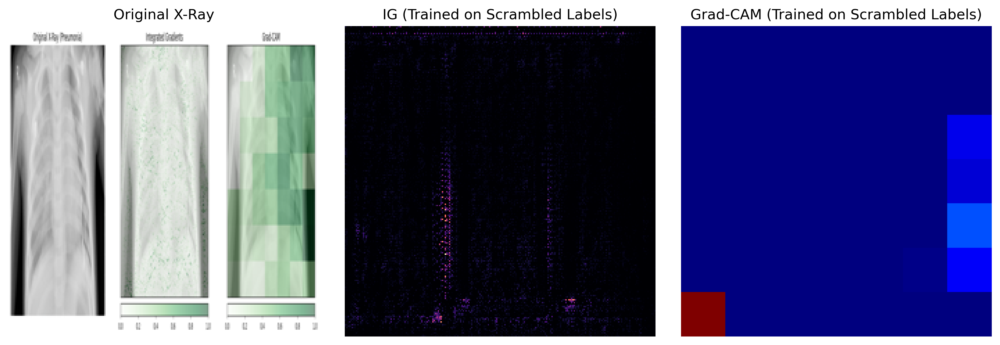
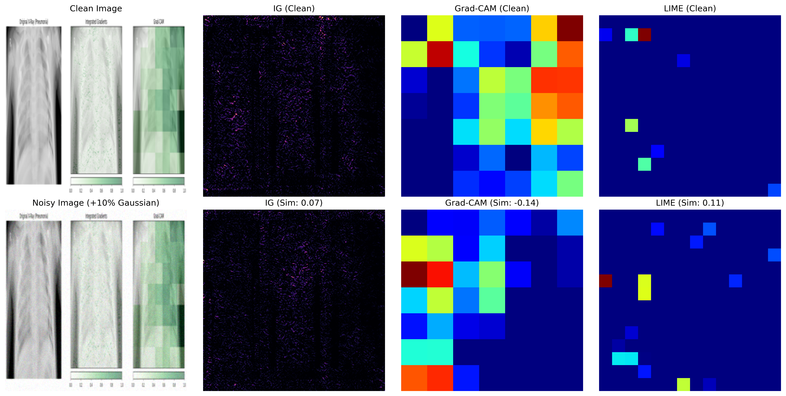

# CNN Saliency Evaluation: Faithfulness vs. Sanity in Medical Imaging


This repository contains the official code, evaluation scripts, and failure analysis for our research on the reliability of Explainable AI (XAI) in medical imaging. 

We evaluate the trustworthiness of **Integrated Gradients (IG), Grad-CAM, and LIME** using a ResNet-50 model trained to detect pneumonia from chest X-rays. Instead of relying on subjective visual inspection, we subject these methods to rigorous mathematical stress tests to prove that **visual appeal does not equal algorithmic reliability.**

---

## 🔬 Core Findings & Visual Evidence

Our research exposes a critical vulnerability in current XAI applications: methods that achieve high pixel-level faithfulness can still completely fail parameter sanity checks.

### 1. The Extreme Sanity Check (Data Randomization)
We simulated a completely ignorant model by scrambling the training labels. A reliable XAI method should output meaningless noise when the model has learned nothing.
* **Grad-CAM** correctly collapses into disorganized heatmaps.
* **Integrated Gradients** acts as an ignorant edge-detector, continuing to perfectly outline the lungs despite the model's lack of diagnostic intelligence.


*> Figure 1: Explanations extracted from a ResNet-50 model trained to convergence on completely scrambled labels.*

### 2. Robustness to Input Perturbations
We injected an imperceptible **10% Gaussian noise** into the X-ray to simulate sensor static. All methods exhibited severe mathematical fragility. Grad-CAM, despite passing sanity checks, entirely inverted its focus (Cosine Similarity: -0.140).


*> Figure 2: Visual comparison of explanation robustness against 10% Gaussian sensor noise.*

---

## ⚙️ Quick Start & Reproducibility

This repository is designed to be easily reproducible. All metrics, heatmaps, and evaluations from the paper can be generated using the provided scripts.

### Installation
Ensure you have Python 3.8+ installed, then clone this repository and install the dependencies:
```bash
git clone [https://github.com/GurdarshanSingh78/xai-chest-xray-evaluation](https://github.com/GurdarshanSingh78/xai-chest-xray-evaluation)
cd xai-chest-xray-evaluation
pip install torch torchvision captum matplotlib numpy Pillow
```

### Execution Scripts
Run the following scripts to reproduce the specific evaluations discussed in the paper:

**1. LIME Faithfulness Evaluation** Estimates the Deletion and Insertion AUC metrics using superpixel perturbation.
```bash
python lime_faithfulness.py
```

**2. Robustness Analysis** Injects Gaussian noise and calculates the Cosine Similarity between clean and noisy 1D flattened attribution arrays.
```bash
python evaluate_robustness.py
```

**3. Dataset Label Randomization** Trains a baseline model on scrambled labels to execute the extreme sanity check.
```bash
python label_randomization.py
```

---

## 📂 Repository Structure

```text
├── chest_xray/                 # Kaggle dataset (Not included, download separately)
├── resnet50_pneumonia_baseline.pth # Pre-trained accurate baseline model
├── evaluate_robustness.py      # Script for noise injection & cosine similarity
├── label_randomization.py      # Script for extreme sanity check training
├── lime_faithfulness.py        # Script for LIME pixel-level AUC metrics
├── robustness_comparison.png   # Generated output: Robustness grid
├── label_randomization_check.png # Generated output: Sanity check grid
└── README.md                   # Project documentation
```